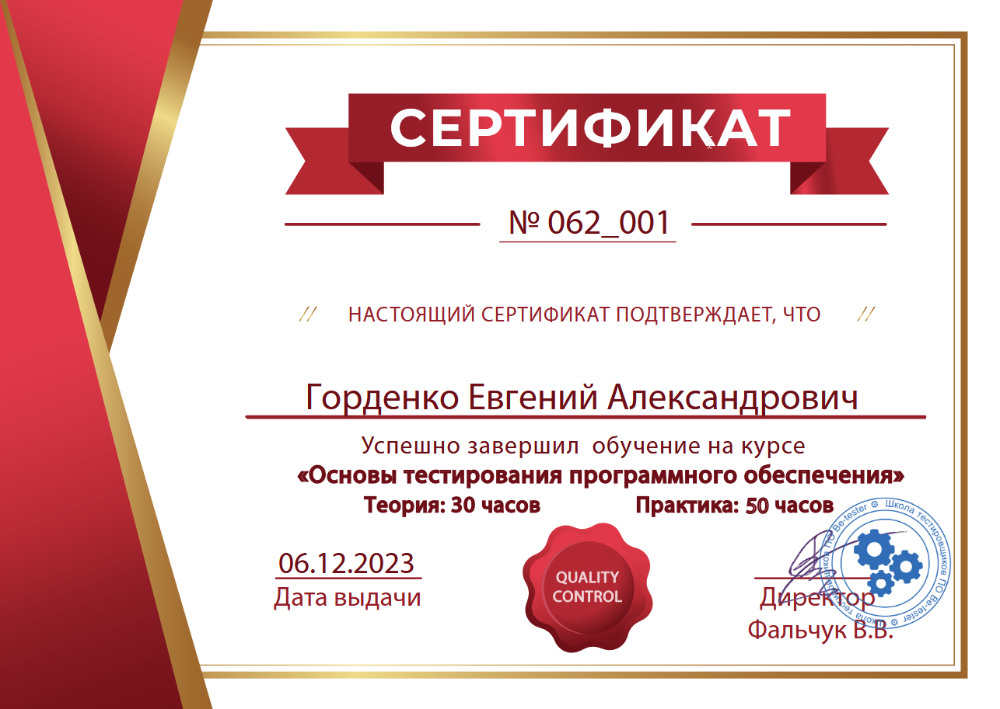

# 📚 Book Store — UI Automation

> Учебный проект по автоматизации web-тестирования интернет-магазина книг с помощью Python + Selenium.

[](https://www.python.org/)
[](https://www.selenium.dev/)

## 📌 О проекте

Небольшой учебный проект, созданный для практики **UI automation на Selenium WebDriver**.

В качестве тестового стенда используется учебный интернет-магазин:

**Automation Testing — Practice Site**

Основной фокус проекта — понять базовый цикл UI-автоматизации:

```text
Открыть страницу
      ↓
Найти элемент
      ↓
Выполнить действие
      ↓
Дождаться результата
      ↓
Проверить ожидаемое состояние
      ↓
Закрыть браузер
```

---


## 🎓 Сертификат

Подтверждение прохождения курса **«Основы тестирования программного обеспечения»**.

**Дата выдачи:** 06.12.2023  
**Номер сертификата:** № 062_001

<p align="center">
  
</p>

> Сертификат подтверждает успешное завершение обучения. В документе указано 30 часов теории; продолжительность практики в представленном документе не заполнена. fileciteturn0file0L2-L8

## 🧪 Что автоматизируется

В проекте представлены сценарии для основных пользовательских потоков.

### 🔐 Authentication

- переход в My Account;
- регистрация пользователя;
- ввод email;
- ввод password;
- авторизация;
- ожидание появления Logout.

### 🛒 Shop

Учебные сценарии включают:

- переход в Shop;
- открытие страницы товара;
- проверку отображения товара;
- проверку количества товаров в категории;
- сортировку товаров;
- проверку цены со скидкой;
- работу с корзиной;
- изменение количества товара;
- применение coupon;
- переход к checkout;
- заполнение billing information;
- оформление заказа.

### 💬 Reviews

- открытие страницы книги;
- переход к отзывам;
- выбор рейтинга;
- заполнение текста отзыва;
- заполнение имени и email;
- отправка отзыва.

---

## 🗂️ Структура

```text
.
├── home.py
├── login_registration.py
├── shop.py
├── __init__.py
└── README.md
```

### `home.py`

Сценарий взаимодействия с главной страницей:

```text
Home
 ↓
Scroll
 ↓
Book
 ↓
Reviews
 ↓
Rating
 ↓
Review
 ↓
Submit
```

### `login_registration.py`

Содержит сценарии:

- регистрации;
- авторизации.

Часть первоначальных вариантов сохранена в комментариях как история обучения.

### `shop.py`

Основной файл проекта.

Содержит учебные сценарии работы с магазином:

```text
Shop
 ├── Product
 ├── Category
 ├── Sorting
 ├── Discount
 ├── Cart
 └── Checkout
```

---

## 🧰 Tech Stack

| Technology | Purpose |
|---|---|
| Python | язык автоматизации |
| Selenium WebDriver | UI automation |
| Chrome | browser |
| WebDriverWait | explicit waits |
| Expected Conditions | ожидание состояний UI |
| CSS Selector | поиск элементов |
| XPath | поиск элементов |
| Link Text | поиск ссылок |

---

## 🔎 Примеры Selenium-подходов

### Поиск элемента

```python
driver.find_element(By.ID, "username")
```

### CSS selector

```python
driver.find_element(
    By.CSS_SELECTOR,
    "[name='login']"
)
```

### Explicit Wait

```python
WebDriverWait(driver, 20).until(
    EC.element_to_be_clickable(
        (By.CSS_SELECTOR, ".checkout-button")
    )
)
```

### Проверка результата

```python
assert len(test_count) == 3
```

---

## ▶️ Запуск

Создать virtual environment:

```bash
python -m venv venv
```

Windows:

```bash
venv\Scripts\activate
```

Установить Selenium:

```bash
pip install selenium
```

Запустить нужный сценарий:

```bash
python home.py
```

или:

```bash
python login_registration.py
```

или:

```bash
python shop.py
```

Для работы проекта требуется установленный Google Chrome и совместимый ChromeDriver.

> Текущая версия проекта использует старый Selenium API и локальный путь к ChromeDriver. Это сохранено намеренно: README описывает текущий код, а не выполняет его рефакторинг.

---

## 📈 Чему учит проект

Этот небольшой проект хорошо показывает эволюцию начинающего AQA:

```text
find_element
     ↓
CSS / XPath
     ↓
WebDriverWait
     ↓
Expected Conditions
     ↓
Assertions
     ↓
User Flow Automation
```

Практикуются важные базовые навыки:

- локаторы;
- взаимодействие с UI;
- ожидания;
- assertions;
- формы;
- dropdown;
- корзина;
- checkout;
- end-to-end сценарии.

---

## 👨‍💻 About

**QA Automation Engineer / Python**

Проект является одной из ранних ступеней обучения автоматизации UI-тестирования и показывает переход от ручных действий в браузере к воспроизводимым автоматизированным сценариям.
